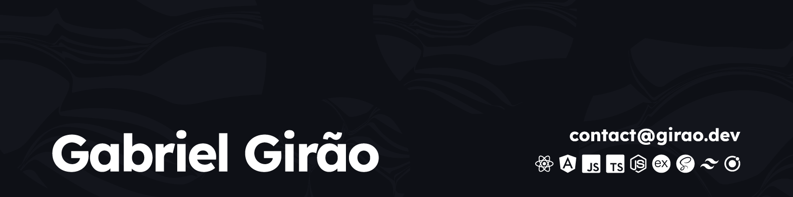
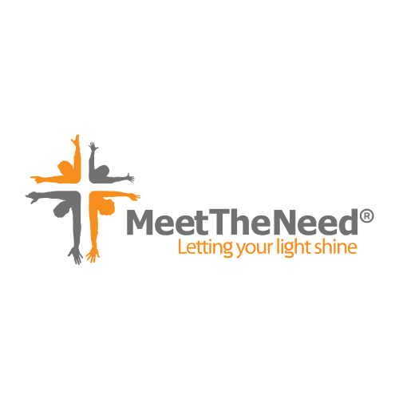

## Hi, I'm Gabriel 👋
I'm Gabriel Girão - a Fullstack developer. I like experimenting with new technologies, building small projects, and occasionally working with UI/UX design.

### About me
* 🌱 Working as a Fullstack Developer @ Meet The Need Ministries using Angular, PHP, Laravel & Ionic
* 💼 I'm currently revising Data Structures & Algorithms through Leetcode, as well as doing the occasional personal side projects
* 🎓 Attending full-stack development specialization courses @ Rocketseat and Full Stack Club. Starting a Software Engineering Bachelor's Degree @ Faculdade Descomplica in June/2024.
* 🤝 Contributing to two MVPs and Volunteering side projects development study groups.

### My Skills

### Working Experience
Below you will find my most recent work experience:

**Fullstack Developer** \
[**Meet The Need Ministries**](https://www.meettheneed.org/) • Part-time \
Languages & Technologies: `Angular`, `Laravel`, `PHP`, `TypeScript`, `Docker`, `AWS`\
 

**Frontend Developer & UX/UI Designer** \
[**Lion Art Creative Studio**](https://www.lionart.com.br/) • Freelancer \
Languages & Technologies: `PHP`, `Wordpress`, `Javascript`, `HTML`, `CSS` \
 

#### Let's create something awesome together!

 
  
  
   

<!-- 

-->
